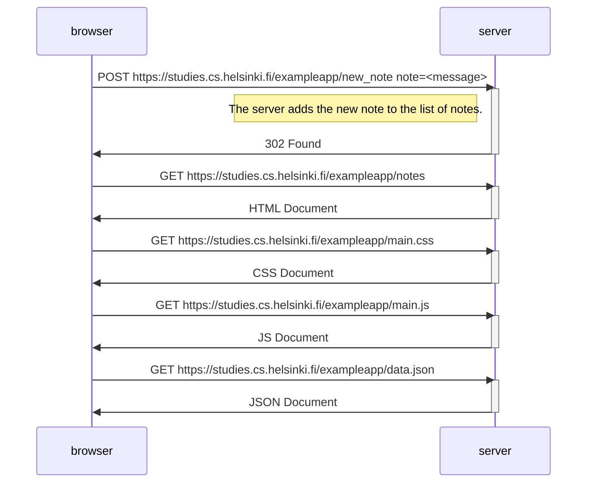

```mermaid
sequenceDiagram

browser->>server: POST https://studies.cs.helsinki.fi/exampleapp/new_note note=<message>
activate server
Note left of server: The server adds the new note to the list of notes.
server->>browser: 302 Found
deactivate server

browser->>server: GET https://studies.cs.helsinki.fi/exampleapp/notes
activate server
server->>browser: HTML Document
deactivate server

browser->>server: GET https://studies.cs.helsinki.fi/exampleapp/main.css
activate server
server->>browser: CSS Document
deactivate server

browser->>server: GET https://studies.cs.helsinki.fi/exampleapp/main.js
activate server
server->>browser: JS Document
deactivate server

browser->>server: GET https://studies.cs.helsinki.fi/exampleapp/data.json
activate server
server->>browser: JSON Document
deactivate server

```