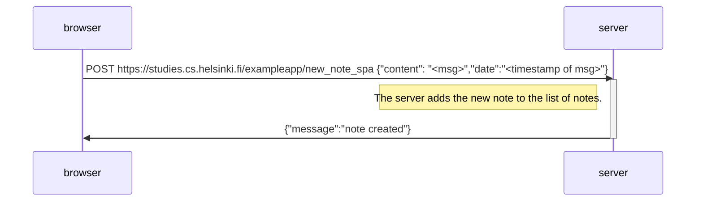

```mermaid
sequenceDiagram

browser->>server: POST https://studies.cs.helsinki.fi/exampleapp/new_note_spa {"content": "<msg>","date":"<timestamp of msg>"}
activate server
Note left of server: The server adds the new note to the list of notes.
server->>browser: {"message":"note created"}
deactivate server
```